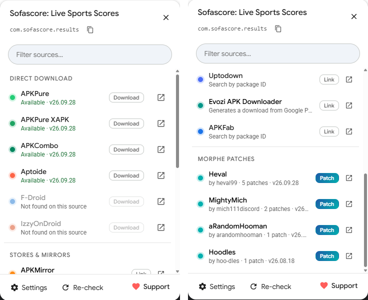

  

<h1 align="center">Sideport</h1>

  <b>Get any Google Play app as an APK, with one button on every app page.</b> 
  Live availability checks · one-click downloads · Morphe patch finder · no tracking

  
  
  
  

  

  

  
   
  Every source is checked in the background, so you see which ones have the app (and which version) before clicking.

---

## 📦 Install

1. Install a userscript manager:  [Tampermonkey](https://www.tampermonkey.net/),  [Violentmonkey](https://violentmonkey.github.io/) or  [Greasemonkey](https://www.greasespot.net/) (Chrome, Edge, Firefox).
2. **[Click here to install Sideport](https://github.com/heval99/sideport/raw/main/sideport.user.js)** and confirm in the manager.
3. Open any app on [play.google.com](https://play.google.com/store/apps). 🎉

> [!TIP]
> The first time Sideport checks a source, your userscript manager asks whether the script may connect to that site. Choose **Always allow**, or allow each domain once.

🔄 **Updates** install automatically. Tampermonkey checks once a day; to update right away, use **Dashboard → Utilities → Check for userscript updates**.

## ✨ What it does

A **Get APK** menu next to Play's Install button, with everything in one place:

### 📥 Direct downloads

| Source | What you get |
|---|---|
|  **APKPure** | Latest APK, plus an XAPK bundle option |
|  **APKCombo** | Every variant (APK / XAPK / architecture) to pick from |
|  **Aptoide** | Base APK plus split APKs and OBB files |
|  **F-Droid** | Open-source builds; the archive of older builds is off by default |
|  **IzzyOnDroid** | Open-source builds |
|  **Guardian Project** | Official builds of privacy apps (Signal, Orbot…) |

### 🏬 Stores & mirrors

| Source | What you get |
|---|---|
|  **APKMirror** | Search by package ID |
|  **Uptodown** | Checked in the background; opens the exact app page |
|  **Evozi** | Generates a download from Google Play |
|  **APKFab** | Search by package ID |
|  **GitHub** | Repositories mentioning the app (off by default) |

### 🧩 Morphe patches

 If [Morphe](https://morphe-patches.software/#apps) patches exist for the app, a **Morphe · N patches** button appears next to Get APK, and the menu lists the official patches and every community bundle. **Recommended bundles come first** and link to their repos:

- 🐦 [**piko**](https://github.com/crimera/piko): X and Instagram
- 🤫 [**Hush** bundles by SysAdminDoc](https://github.com/SysAdminDoc): Facebook, Messenger, Instagram, TikTok, Threads, Telegram, Pinterest
- ⌨️ [**Gboard patches**](https://github.com/jasonwu1994/Gboard-patches) by jasonwu1994: Gboard
- ⚽ [**Heval**](https://github.com/heval99/Heval-Morphe-Patches): Sofascore, BeSoccer, BoxBox and more

The patch list stays fresh: Sideport checks Morphe for changes every 30 minutes, which costs a few hundred bytes when nothing changed.

### ⚡ And also

- ✅ **Availability check:** every direct source (and Uptodown) shows *Available · v1.2.3* or *Not found* before you click.
- 🖱️ **One-click downloads:** the file starts in a new tab. Split APKs and multi-variant apps show a list to pick from.
- 🌱 **Open-source alternatives** where they exist (e.g. NewPipe for YouTube).
- 🌗 Follows Play's **light and dark theme**, with full **keyboard navigation**, a filter box and copy package ID.
- 🌍 Works for apps that **aren't available in your country**.
- 💳 **Paid apps** get store links only: direct downloads and mod sites are hidden.
- 🧪 **Modded APKs:** off by default; see [Safety](#%EF%B8%8F-safety).

## ⚙️ Settings

Open the menu → **Settings**:

- Show modded APK sites (off by default)
- Show Morphe patches
- Check availability automatically
- Open downloads in a new tab
- Turn individual sources on or off
- Refresh the Morphe patch list now

Your userscript manager's menu (click its icon on a Play page) also has **Open APK sources**, **Copy package ID**, **Copy diagnostics (for bug reports)** and **Support Sideport on Ko-fi**.

## 🧭 Compatibility and known limitations

- 💻 **Browsers:** made for desktop Chrome, Edge and Firefox with Tampermonkey, Violentmonkey or Greasemonkey. Play's mobile website hasn't been tested.
- 🗣️ **Language:** the menu is in English, but it works on Play pages in any language.
- ☁️ **Cloudflare:** APKPure and APKCombo sometimes show a browser check. When a source says *Cloudflare check*, open it once with the ↗ icon.
- 🧾 **Paid apps you've bought** still count as paid, so only store links are shown for them.

## 🔒 Privacy

- 🚫 No analytics, no tracking, no accounts, no servers of its own.
- 🌐 Sideport only talks to the sources listed above, and only when you're on a Play app page. Requests go straight from your browser to those sites.
- 💾 It stores two things in your userscript manager's local storage: your settings, and a compact summary of Morphe's patch list (about 180 KB).

## 🛡️ Safety

- APK files come from third-party sites, not from Google. Prefer the original-release sources, and check signatures or scan files when in doubt.
- Sideport only opens `https://` links, and for direct downloads it checks that the file comes from the source's own domains.

> [!WARNING]
> **Modded APKs** are unverified, repackaged files, and several mod sites are known for adware or malware. That's why the section is **off by default** and carries a warning. Sideport only links to their search pages; it never downloads from them.

## 🌐 For site owners

Sideport is a link helper, not a mirror. It never hosts, re-uploads or modifies files. Here is how it uses each source:

- **Only on demand.** A source is contacted only when someone opens the Sideport menu on a Google Play app page, and only for that one app. Nothing is crawled or prefetched in bulk.
- **From the user's own browser.** Requests come straight from the visitor's browser (no Sideport server in between), so your site sees normal visits and keeps its own ads, Cloudflare checks and download pages.
- **Light lookups.** To show *Available* or *Not found*, Sideport makes one lookup per app: your public search or API endpoint, or a `HEAD` request. Results are cached in the user's browser.
- **Your links stay yours.** Downloads open your own URLs; for store links, users land on your site.

📮 **Want your site removed, or changed** (for example link-only, no background checks)? [Open a removal request](https://github.com/heval99/sideport/issues/new?template=source-removal.yml&labels=source-removal) and it will be handled promptly. Sideport respects every request, no questions asked. The change ships in the next update, which installed copies receive automatically.

## ❓ FAQ

<b>A source says "Couldn't check · Cloudflare check".</b>

The site is asking for a browser check. Click the ↗ icon to open the site once; afterwards background checks usually work again.

<b>The button doesn't appear, or a source fails.</b>

Open your userscript manager's menu on that Play page and choose **Copy diagnostics (for bug reports)**, then paste the result into a [new issue](https://github.com/heval99/sideport/issues) together with the app link. If Play hides or keeps redrawing its button row (this happens on some pages when you're signed in), Sideport moves its button next to the app title instead of disappearing.

<b>Can I add a source?</b>

Yes, [open an issue](https://github.com/heval99/sideport/issues) or a pull request. See [Contributing](#-contributing).

## 🤝 Contributing

- 💡 **Suggest a source:** [open an issue](https://github.com/heval99/sideport/issues) with the site and an example app link. Sources that work by package ID and offer original, signed APKs are preferred.
- 🧩 **Recommend a Morphe bundle:** if it's listed on [morphe-patches.software](https://morphe-patches.software/#apps), send the GitHub repo. Adding it to the recommended list is a one-line change.
- 🐞 **Report a bug:** include the output of **Copy diagnostics** (see the [FAQ](#-faq)).
- 🔧 **Pull requests** are welcome. Please keep the script dependency-free and test it on a few app pages, both free and paid.

## ☕ Support

Sideport is free, with no ads or tracking. If it saves you time, you can support development on **[Ko-fi ♥](https://ko-fi.com/heval99)**. You'll also find a *Support* link in the menu and your userscript manager's menu.

## 🧩 More from heval99

**[Heval Morphe Patches](https://github.com/heval99/Heval-Morphe-Patches)**: my own Morphe patch bundle for apps like Sofascore, BeSoccer and BoxBox, covering ad and telemetry removal and more. If Sideport shows a *Morphe* badge on one of those apps, my bundle is among the results.

## 🙏 Credits

- Google Play install-button detection and the price-tag check are adapted from [Direct download from Google Play](https://greasyfork.org/scripts/33005) by **StephenP**, the userscript that inspired Sideport.
- Patch data comes from [Morphe](https://morphe.software/) and its community bundle index at [morphe-patches.software](https://morphe-patches.software/).
- Source logos are each site's own favicon, shown for recognition only.

## 📄 License

Sideport is **source-available** under the [PolyForm Noncommercial License 1.0.0](LICENSE.md). You may use, modify and share it for any **non-commercial** purpose. Selling it or using it commercially is not allowed. (This is not an OSI "open source" license.)

Sideport is not affiliated with Google, Morphe, or any of the listed sources. Google Play is a trademark of Google LLC.
