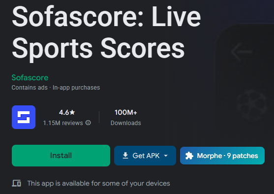
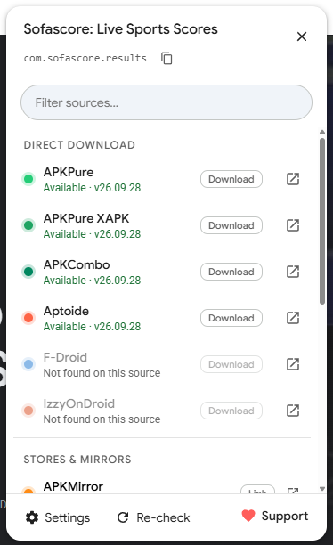
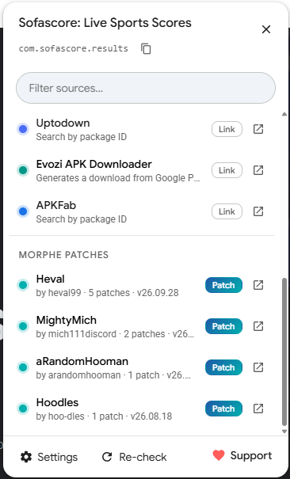

# Sideport

**Get any Google Play app as an APK — one button on every app page.**

Sideport is a userscript that adds a **Get APK** button next to *Install* on Google Play. It finds the app on trusted APK sources, checks which ones actually have it, and downloads it in one click. It also tells you when [Morphe](https://morphe.software/) patches exist for the app.

  

  
  &nbsp;
  
   
  Every source is checked in the background, so you see which ones have the app (and which version) before clicking. Morphe patch bundles for the app are listed too.

## Install

1. Install a userscript manager: [Tampermonkey](https://www.tampermonkey.net/), [Violentmonkey](https://violentmonkey.github.io/) or [Greasemonkey](https://www.greasespot.net/) (Chrome, Edge, Firefox).
2. **[Click here to install Sideport](https://github.com/heval99/sideport/raw/main/sideport.user.js)** and confirm in the manager.
3. Open any app on [play.google.com](https://play.google.com/store/apps).

The first time Sideport checks a source, your userscript manager asks whether the script may connect to that site. Choose **Always allow** (or allow each domain once). Updates install automatically through your userscript manager.

## What it does

**Get APK menu**, next to Play's Install button:

| Section | Sources |
|---|---|
| **Direct download** | APKPure, APKPure XAPK, APKCombo, Aptoide, F-Droid, IzzyOnDroid, Guardian Project, F-Droid archive (off by default) |
| **Stores & mirrors** | APKMirror, Uptodown (checked, links the exact app page), Evozi, APKFab, GitHub (off by default) |
| **Morphe patches** | Official Morphe patches and every community bundle for the app. Recommended bundles come first: [piko](https://github.com/crimera/piko) (X, Instagram), the [Hush](https://github.com/SysAdminDoc) bundles by SysAdminDoc (Facebook, Messenger, Instagram, TikTok, Threads and more), [Gboard patches](https://github.com/jasonwu1994/Gboard-patches) by jasonwu1994 and [Heval](https://github.com/heval99/Heval-Morphe-Patches) |
| **Open-source alternatives** | e.g. NewPipe for YouTube |
| **Modded APKs** | Off by default; see [Safety](#safety) |

- **Availability check:** when the menu opens, every direct source is checked in the background and shows *Available · v1.2.3* or *Not found*.
- **One-click downloads:** the file starts in a new tab. Apps that ship as split APKs (Aptoide) or come in several variants (APKCombo) show a list so you can pick the right file.
- **Morphe badge:** if the app has [Morphe](https://morphe-patches.software/#apps) patches, a *Morphe · N patches* button appears next to Get APK and links straight to the app's patch page. The patch list stays fresh: Sideport checks Morphe for changes every 30 minutes, which costs a few hundred bytes when nothing changed.
- **Also:** follows Play's light and dark theme, full keyboard navigation (arrow keys, Home/End, Esc), a filter box, copy package ID, and a banner for apps that aren't available in your country.
- **Paid apps:** only store links are shown; direct downloads and mod sites are hidden.

## Settings

Open the menu → **Settings**, or use your userscript manager's menu:

- Show modded APK sites (off by default)
- Show Morphe patches
- Check availability automatically
- Open downloads in a new tab
- Turn individual sources on or off
- Refresh the Morphe patch list now

## Privacy

- No analytics, no tracking, no accounts, no servers of its own.
- Sideport only talks to the sources listed above, and only when you're on a Play app page. Requests go straight from your browser to those sites.
- It stores two things in your userscript manager's local storage: your settings, and a compact summary of Morphe's patch list (about 180 KB).

## Safety

- APK files come from third-party sites, not from Google. Prefer the original-release sources, and check signatures or scan files when in doubt.
- **Modded APKs** are unverified, repackaged files, and several mod sites are known for adware or malware. That's why the section is **off by default** and carries a warning. Sideport only links to their search pages; it never downloads from them.
- Sideport only opens `https://` links, and for direct downloads it checks that the file comes from the source's own domains.

## For site owners

Sideport is a link helper, not a mirror. It never hosts, re-uploads or modifies files. Here is how it uses each source:

- **Only on demand.** A source is contacted only when someone opens the Sideport menu on a Google Play app page, and only for that one app. Nothing is crawled or prefetched in bulk.
- **From the user's own browser.** Requests come straight from the visitor's browser (no Sideport server in between), so your site sees normal visits and keeps its own ads, Cloudflare checks and download pages.
- **Light lookups.** To show *Available* or *Not found*, Sideport makes one lookup per app: your public search or API endpoint, or a `HEAD` request. Results are cached in the user's browser.
- **Your links stay yours.** Downloads open your own URLs; for store links, users land on your site.

**Want your site removed, or changed** (for example link-only, no background checks)? [Open a removal request](https://github.com/heval99/sideport/issues/new?template=source-removal.yml&labels=source-removal) and it will be handled promptly. Sideport respects every request, no questions asked. The change ships in the next update, which installed copies receive automatically.

## FAQ

**A source says "Couldn't check · Cloudflare check".** The site is asking for a browser check. Click the ↗ icon to open the site once; afterwards background checks usually work again.

**The button doesn't appear, or a source fails.** Open your userscript manager's menu on that Play page and choose **Copy diagnostics (for bug reports)**, then paste the result into a [new issue](https://github.com/heval99/sideport/issues) together with the app link. If Play keeps redrawing its button row (this happens on some pages when you're signed in), Sideport moves its button next to the app title instead of disappearing.

**Can I add a source?** Yes, [open an issue](https://github.com/heval99/sideport/issues) or a pull request.

## Support

Sideport is free, with no ads or tracking. If it saves you time, you can support development on **[Ko-fi ♥](https://ko-fi.com/heval99)**. You'll also find a *Support* link in the menu and your userscript manager's menu.

## More from heval99

🧩 **[Heval Morphe Patches](https://github.com/heval99/Heval-Morphe-Patches)**: my own Morphe patch bundle for apps like Sofascore, BeSoccer and BoxBox, covering ad and telemetry removal and more. If Sideport shows a *Morphe* badge on one of those apps, my bundle is among the results.

## Credits

- Google Play install-button detection and the price-tag check are adapted from [Direct download from Google Play](https://greasyfork.org/scripts/33005) by **StephenP**, the userscript that inspired Sideport.
- Patch data comes from [Morphe](https://morphe.software/) and its community bundle index at [morphe-patches.software](https://morphe-patches.software/).

## License

Sideport is **source-available** under the [PolyForm Noncommercial License 1.0.0](LICENSE.md). You may use, modify and share it for any **non-commercial** purpose. Selling it or using it commercially is not allowed. (This is not an OSI "open source" license.)

Sideport is not affiliated with Google, Morphe, or any of the listed sources. Google Play is a trademark of Google LLC.
